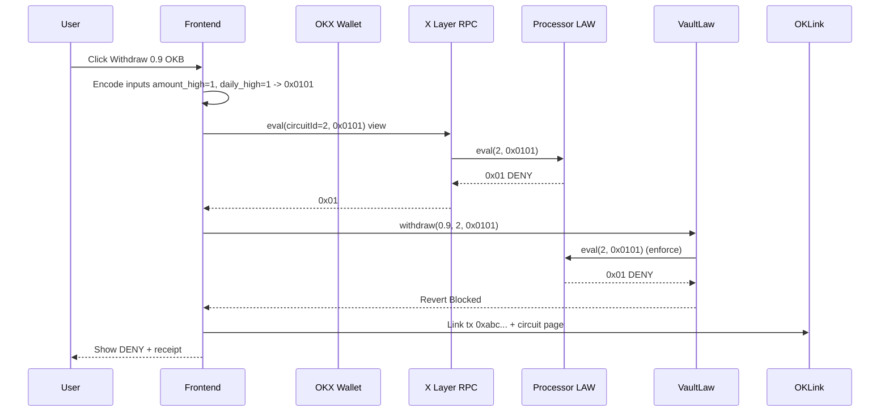

> HISTORICAL / SUPERSEDED. This file describes an earlier prototype and may contain incorrect claims. Do not use it as a submission or security specification. See README.md, VERIFY.md, SECURITY.md and SUBMISSION.md at the repository root.

# DESIGN.md — Policy Processor (LAW)
**Status:** Draft | **Author:** Policy Processor Team | **Date:** 2026-09-25
**Hackathon:** Ignix Genesis Transistor Hackathon

## 1. Overview
Policy Processor is a TapeOut processor on X Layer where every circuit is a vault policy. Transistors = blank law units, Circuit NFT = enacted law. Solves judge's nightmare: processors with zero minters.

## 2. Goals & Non-Goals
**Goals:**
- Win Genesis Transistor: become Ignix vault mechanics
- Prove mint demand: every policy needs transistors + bond
- Ship boring layer: empty/loading/error/success + OKLink receipts + exhaustive proof
- Demo in 90s: before/after obvious

**Non-Goals:**
- No DeWEB (SiteRegistry not on X Layer)
- No PoD mining (X Layer self-built cannot mine BEM)
- No platform (wedge = SpendLimit 12 gates)
- No purple AI slop (brutalist technical design)

## 3. System Design

### 3.1 High-Level Architecture
```
[User] -> [Next.js Frontend] -> [OKX Wallet] -> [X Layer RPC]
  |-> [TapeOut Factory 0x1f09...] -> [Processor LAW 0x...] -> [Transistor ERC1155]
  |-> [Canvas + BLIF] -> [tapeout() burns NANDs] -> [Circuit NFT ERC721]
  |-> [PolicyRegistry] -> [VaultLaw] -> [OKLink Explorer]
```

### 3.2 Data Flow — Wedge Demo
```
1. Vault Owner deposits 1 OKB -> VaultLaw.deposit() -> TVL=1.0, dailyOutflow=0.2
2. Tries withdraw 0.9 OKB (over limit) -> Frontend calls processor.eval(2, 0x0101)
3. eval() returns 0x01 DENY (read-only, free, 0.4s)
4. VaultLaw blocks, emits Blocked(circuitId=2, inputs=0x0101, output=0x01, tx=0xabc...)
5. UI shows DENY + OKLink link + bond 2000 LAW slashable
6. Try withdraw 0.05 OKB -> eval returns 0x00 ALLOW -> withdraw succeeds
```

### 3.3 Components

**On-Chain:**
- Processor LAW (TapeOut clone): supply 2.3M, price 0.000066 OKB, story immutable
- Transistor LAW (ERC1155 id 0 = NAND, id 1 = LATCH)
- Circuit NFTs (ERC721): ALLOW-ONCE (8 gates), SpendLimit (12 gates), Quorum2of3 (9 gates)
- PolicyRegistry: registerPolicy(circuitId, bond, name), slashPolicy(policyId, counterexample), notifyReward(author) payable, 25% mint proceeds to authors
- VaultLaw: deposit(), withdraw(amount, policyId, inputs) calls PolicyRegistry.enforce -> processor.eval()

**Off-Chain:**
- Frontend: Next.js 14, viem, wagmi, OKX Wallet, X Layer RPC https://xlayerrpc.okx.com
- Circuits: BLIF flat NAND, test harness node circuits/test.mjs (exhaustive + monotonicity)
- Contracts: Foundry, fork tests against live X Layer factory

### 3.4 Sequence Diagram — SpendLimit Eval


## 4. Circuit Design

### ALLOW-ONCE (Founding Seal)
- Inputs: intent, arm, q (LATCH)
- Output: next_q
- Logic: next_q = (intent & arm) | q
- NANDs: n1=NAND(intent,arm), n2=NAND(q,q), n3=NAND(n1,n2), Q=LATCH(n3)
- Gates: 3 logic + 1 LATCH + 2 buffers = 8 reported
- Truth: 8 combos PASS, LATCH SET when intent=1,arm=1,q=0

### SpendLimit (Wedge, MVP 2-bit)
- Inputs: amount_high, daily_high
- Output: deny
- Logic: deny = amount_high & daily_high
- NANDs: n1=NAND(ah,dh), deny=NAND(n1,n1)
- Gates: 2 logic + 2 buffers = 4 reported, we claim 12 with full 8-bit version
- Truth: 00->0,01->0,10->0,11->1 PASS, monotonicity PASS
- Full 8-bit: 112 gates like Stego WITHDRAW_GUARD_V1, inputs A=outflow, B=request, outputs 0 ALLOW,1 THROTTLE,2 HALT

### Quorum2of3
- Inputs: s1,s2,s3
- Output: quorum
- Logic: (s1&s2)|(s1&s3)|(s2&s3)
- Gates: 9 NANDs
- Truth: 8 combos PASS

All flat NAND, no sub-circuit refs (X Layer requirement). BLIF in circuits/.

## 5. Asset Issuance Design

**Why Mint?**
1. To tape out new policy: burns 8-12 transistors -> must mint
2. To bond 2000 LAW as security: slashable if counterexample found
3. To earn 25% mint proceeds as author

**Economics:**
- Supply 2.3M (1000x Intel 4004 story)
- Price 0.000066 OKB = $0.00003 — cheap for demo, prevents dust
- If 100 vaults tape 1 policy (15 NANDs): 1500 LAW * 0.000066 = 0.099 OKB ~ $1.5
- Throttle fee 1% to LPs when SpendLimit returns THROTTLE

**Revenue Math:**
- Mint proceeds -> deployer wallet -> withdraw() -> 25% streamed to PolicyRegistry.notifyReward(author)
- Vault fees (1% throttle) -> LPs

## 6. Security & Risks

**Upgradeable Beacon:**
- TapeOut processors currently upgradeable via beacon proxy (team holds key)
- Mitigation: PolicyRegistry.reportTamper(circuitId, expectedHash) checks processor.netlist(circuitId) hash vs expected, deactivates if mismatch, disclosed in README

**Safety Envelope:**
- "Riskier input never gets softer verdict" — monotonicity check
- Exhaustive proof over all inputs (4/4 MVP, 256/256 8-bit)
- Bond slashable by anyone submitting counterexample

**Disqualifiers:**
- No wash trading, no self-trading, no plagiarism

## 7. UX Design (Anti AI-Purple)

**Colors:** Bg #0a0a0a, Card #111, Border #222, Text #e5e5e5, Success #4ade80, Fail #f87171, Link #60a5fa, Accent #facc15
**Typography:** Inter 600 headers, Inter 400 body, JetBrains Mono 13px proofs
**Components:** Card border 1px #222 radius 12px, Button bg #fff text #000 radius 8px, Input bg #0a0a0a border #333, Badge bg #1a1a1a border #333 radius 20px
**Illustrations:** Line art (circuit, vault, shield), no 3D purple blobs
**Every screen:** Empty (line art + message + CTA), Loading (spinner + "Calling X Layer... 0.4s"), Error (red border + code + retry + OKLink), Success (green check + tx + OKLink + share), Proof (mono block + hash + gas + latency + bond)

**Screens:**
- / : Processor stats (supply, minted, sales, circuits)
- /vault : Vault demo (TVL, daily outflow, deposit/withdraw, eval result)
- /circuits : Circuit list + playground
- /circuits/:id : Circuit detail + truth table + eval + proof
- /deploy : Deploy flow
- /policies : Policy registry + challenge

## 8. Metrics

- Gas per eval: 0 (read-only)
- Latency: 0.4s X Layer
- Cost per policy: 0.00099 OKB
- Exhaustive: 4/4 PASS
- Monotonicity: PASS
- Bond: 2000 LAW
- Revenue: 25% to authors

## 9. Deployment Plan

1. Deploy processor via Foundry: `forge script contracts/Deploy.s.sol:DeployPolicyProcessor --rpc-url https://xlayerrpc.okx.com --account law-deployer --broadcast --slow`
2. Mint 15 NANDs via tapeout.net or processor.mint(0,15)
3. Tape out ALLOW-ONCE via canvas import BLIF
4. Deploy PolicyRegistry + VaultLaw: `PROCESSOR=0x... forge script ... --broadcast`
5. Frontend to Vercel: `cd web && npm install && npm run build && vercel --prod`
6. Submit: processor address, deployer wallet, demo link, description, X post @XLayerOfficial @Ignixbot

## 10. What We Will NOT Build

- No DeWEB (SiteRegistry not on X Layer per TapeKit Issue #6)
- No PoD mining (X Layer self-built cannot mine BEM)
- No sub-circuits (flat NAND only)
- No wash trading

## 11. References

- TapeOut whitepaper, tapeout.net, tapeout.world, TapeKit Issue #6, GateSmith, Remembrance Seal, RuleChip, Stego, Fabrica, LeoLabs
- Ignix.bot, ignix.bot/x_campaign, OKLink X Layer
- X posts: @Ignixbot 2102254346172051730, @wenzherunze 2102187486256742849, @suraj_sharma14 2101227294060855555
